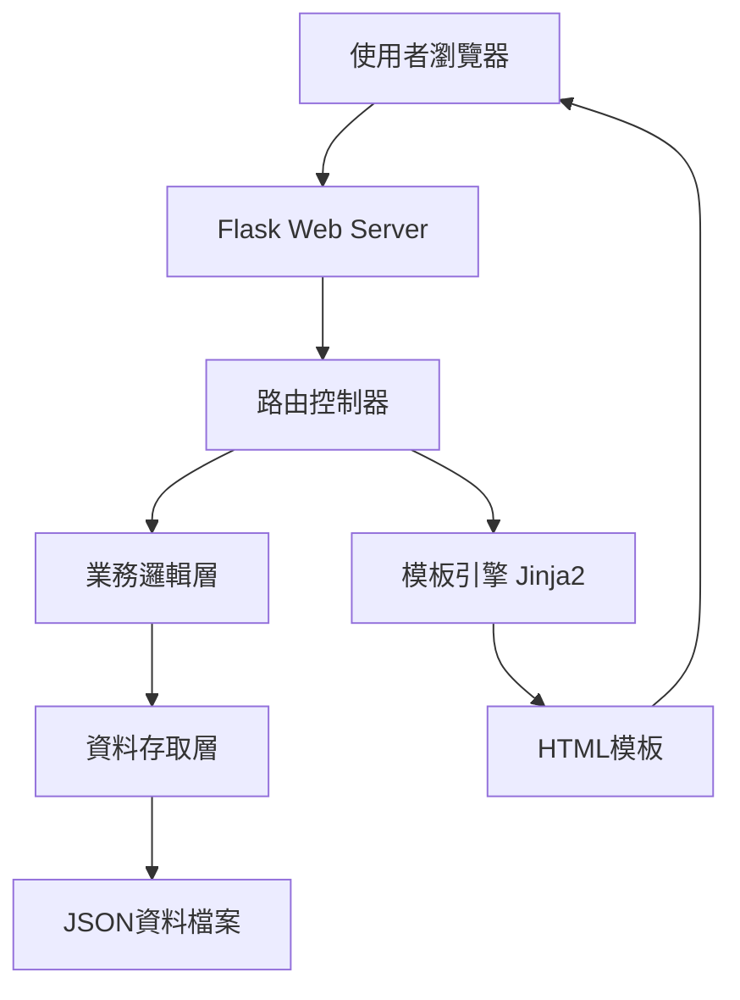

# 設計文件

## 概述

英文單字紀錄簿是一個基於Flask的輕量級Web應用程式，採用MVC架構模式。系統使用JSON文字檔作為資料儲存方式，提供簡潔的網頁介面供使用者管理英文單字學習記錄。

## 架構

### 系統架構圖



### 技術棧

- **後端框架**: Flask 2.3+
- **模板引擎**: Jinja2
- **前端框架**: Bootstrap 5
- **JavaScript**: Vanilla JS (無需額外框架)
- **資料格式**: JSON
- **Python版本**: 3.8+

## 元件和介面

### 1. Web應用程式結構

```
vocabulary_notebook/
├── app.py                 # Flask應用程式主檔案
├── models/
│   └── vocabulary.py      # 單字資料模型
├── services/
│   └── vocabulary_service.py  # 業務邏輯服務
├── templates/
│   ├── base.html         # 基礎模板
│   ├── index.html        # 主頁面
│   ├── add_word.html     # 新增單字頁面
│   ├── edit_word.html    # 編輯單字頁面
│   └── word_detail.html  # 單字詳細頁面
├── static/
│   ├── css/
│   │   └── style.css     # 自定義樣式
│   └── js/
│       └── main.js       # 前端JavaScript
└── data/
    └── vocabulary.json   # 單字資料檔案
```

### 2. 資料模型

#### 單字記錄結構
```json
{
  "id": "unique_identifier",
  "word": "example",
  "chinese_meaning": "例子",
  "english_meaning": "a thing characteristic of its kind",
  "phonetic": "/ɪɡˈzæmpəl/",
  "example_sentence": "This is an example sentence.",
  "synonyms": ["instance", "case", "illustration"],
  "antonyms": ["exception"],
  "created_date": "2025-01-15",
  "updated_date": "2025-01-15"
}
```

#### 資料檔案結構
```json
{
  "vocabulary": [
    {
      "id": "word_001",
      "word": "example",
      ...
    }
  ],
  "metadata": {
    "total_words": 1,
    "last_updated": "2025-01-15T10:30:00"
  }
}
```

### 3. 核心元件

#### VocabularyModel (models/vocabulary.py)
- 定義單字資料結構
- 提供資料驗證方法
- 處理日期格式化

#### VocabularyService (services/vocabulary_service.py)
- 管理JSON檔案讀寫操作
- 實作CRUD功能
- 提供搜尋和篩選邏輯
- 處理時間範圍查詢

#### Flask路由控制器 (app.py)
- 定義Web路由
- 處理HTTP請求和回應
- 整合前端模板

### 4. API端點設計

| 方法 | 路徑 | 功能 | 參數 |
|------|------|------|------|
| GET | / | 主頁面，顯示單字列表 | time_filter (可選) |
| GET | /word/<id> | 顯示單字詳細資訊 | - |
| GET | /add | 顯示新增單字表單 | - |
| POST | /add | 處理新增單字請求 | 表單資料 |
| GET | /edit/<id> | 顯示編輯單字表單 | - |
| POST | /edit/<id> | 處理編輯單字請求 | 表單資料 |
| POST | /delete/<id> | 刪除單字 | - |
| GET | /search | 搜尋單字 | q (查詢字串) |
| GET | /api/stats | 取得時間分類統計資料 | - |

### 5. 時間分類功能詳細設計

#### 5.1 時間篩選服務方法

```python
class VocabularyService:
    def get_words_by_time_filter(self, time_filter: str) -> List[Word]:
        """根據時間篩選條件取得單字列表"""

    def get_time_filter_stats(self) -> Dict[str, int]:
        """取得各時間範圍的單字統計數量"""

    def get_words_by_date_range(self, start_date: datetime, end_date: datetime) -> List[Word]:
        """取得指定日期範圍內的單字"""
```

#### 5.2 前端時間分類介面設計

- **下拉選單**: 主要的時間篩選選擇器
- **快速篩選標籤**: 水平排列的快速選擇按鈕
- **統計資訊卡片**: 顯示各時間範圍的單字數量
- **學習進度圖表**: 視覺化顯示學習趨勢（可選）

## 資料模型

### 單字實體 (Word Entity)

```python
class Word:
    def __init__(self):
        self.id: str
        self.word: str
        self.chinese_meaning: str
        self.english_meaning: str
        self.phonetic: str
        self.example_sentence: str
        self.synonyms: List[str]
        self.antonyms: List[str]
        self.created_date: datetime
        self.updated_date: datetime
```

### 時間篩選邏輯

```python
TIME_FILTERS = {
    'recent_3_days': 3,
    'recent_week': 7,
    'recent_2_weeks': 14,
    'recent_month': 30,
    'recent_3_months': 90,
    'all': None  # 顯示全部
}

TIME_FILTER_LABELS = {
    'recent_3_days': '近三天',
    'recent_week': '近一週',
    'recent_2_weeks': '近兩週',
    'recent_month': '近一個月',
    'recent_3_months': '近三個月',
    'all': '全部'
}
```

## 錯誤處理

### 1. 檔案操作錯誤
- JSON檔案不存在：自動創建空的資料檔案
- JSON格式錯誤：顯示錯誤訊息並提供修復建議
- 檔案權限錯誤：顯示適當的錯誤訊息

### 2. 資料驗證錯誤
- 必填欄位驗證
- 單字重複檢查
- 資料格式驗證

### 3. Web應用程式錯誤
- 404錯誤：單字不存在
- 500錯誤：伺服器內部錯誤
- 表單驗證錯誤

## 測試策略

### 1. 單元測試
- 測試VocabularyService的CRUD操作
- 測試資料驗證邏輯
- 測試時間篩選功能

### 2. 整合測試
- 測試Flask路由功能
- 測試模板渲染
- 測試JSON檔案操作

### 3. 使用者介面測試
- 測試表單提交功能
- 測試搜尋功能
- 測試響應式設計

### 4. 測試資料
- 創建測試用的JSON資料檔案
- 模擬各種邊界情況
- 測試資料備份和恢復

## 使用者介面設計

### 1. 主頁面佈局
- 頂部導航列：包含搜尋框和時間篩選選項
- 側邊欄：時間分類選單
- 主內容區：單字卡片列表
- 浮動按鈕：快速新增單字

### 2. 單字卡片設計
- 顯示單字、中文解釋和記錄日期
- 點擊展開顯示完整資訊
- 操作按鈕：編輯、刪除

### 3. 表單設計
- 清晰的欄位標籤
- 即時驗證回饋
- 自動儲存草稿功能

### 4. 響應式設計
- 桌面版：三欄佈局
- 平板版：兩欄佈局
- 手機版：單欄佈局，可摺疊選單

## 效能考量

### 1. 資料載入最佳化
- 實作分頁功能（每頁20個單字）
- 延遲載入單字詳細資訊
- 快取常用查詢結果

### 2. 檔案操作最佳化
- 批次寫入操作
- 定期備份資料檔案
- 壓縮歷史資料

### 3. 前端效能
- 最小化CSS和JavaScript
- 使用CDN載入Bootstrap
- 實作客戶端快取